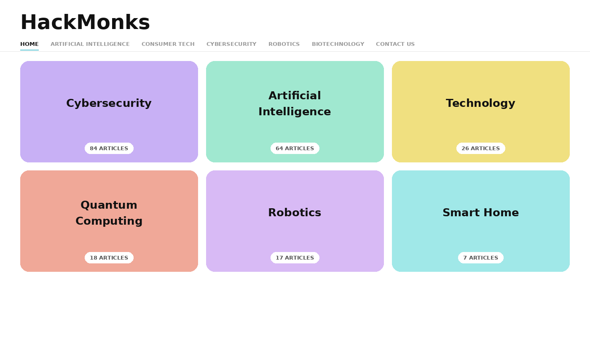
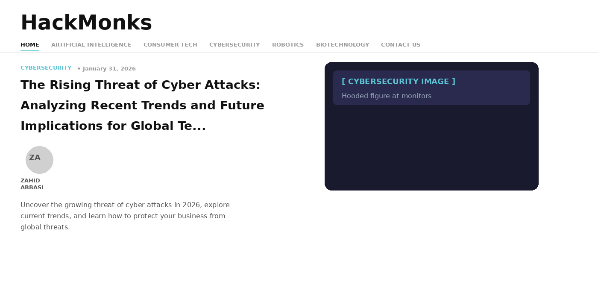

# Lumio — Free Minimal WordPress Theme

**Version:** 1.0.0 · **License:** GPL v2 or later · **Author:** [Zahid Abbasi](https://xuro.net)

A clean, fast WordPress theme built for high-performance blogs. Bold Syne typography, a radial glow hero section, pastel category cards, and a floating table of contents — with zero jQuery and no bloat.

**[Live Demo](https://lumio.xuro.net)** · **[Theme Page](https://xuro.net/lumio)** · **[Download](https://github.com/madzahid/lumio/releases/latest/download/lumio.zip)**

---

## Screenshots

### Homepage — Hero Section


### Homepage — Category Cards


### Single Post


---

## Features

- **Blazing fast** — No jQuery, pure CSS + vanilla JS, 95+ PageSpeed score
- **Bold typography** — Syne for headings, Figtree for body text
- **Radial glow hero** — Distinctive homepage hero with soft light background
- **Pastel category cards** — Visual category archive grid, no plugin needed
- **Floating TOC** — Auto-generated table of contents on every single post
- **SEO ready** — Works with Rank Math and Yoast; built-in Open Graph fallback
- **Social share buttons** — Inline SVG icons (no Font Awesome CDN)
- **Custom local avatars** — Upload author avatars without a plugin
- **Translation ready** — Full text domain support (`lumio`)
- **WordPress 6.0–7.0 compatible** — Tested across all recent major versions

---

## Requirements

| Item | Minimum |
|------|---------|
| WordPress | 6.0 |
| PHP | 7.4 |
| Tested up to | WordPress 7.0 |

---

## Installation

### From GitHub (zip)

1. [Download lumio.zip](https://github.com/madzahid/lumio/releases/latest/download/lumio.zip)
2. Go to **Appearance → Themes → Add New → Upload Theme**
3. Upload `lumio.zip` and click **Install Now**
4. Click **Activate**
5. Go to **Appearance → Menus** to set up your Primary and Footer menus
6. Set your site tagline under **Settings → General** — it appears in the hero section

### From WordPress.org *(pending approval)*

Search for "Lumio" in **Appearance → Themes → Add New**.

### Development (clone)

```bash
cd wp-content/themes/
git clone https://github.com/madzahid/lumio.git lumio
```

---

## Compatibility

- ✅ Rank Math SEO
- ✅ Yoast SEO
- ✅ Classic Editor
- ✅ Gutenberg / Block Editor
- ✅ WooCommerce (basic)

---

## Credits

- **Design inspiration:** [Array Ghost theme](https://brightthemes.com/themes/array) by Bright Themes — design concept only, no code used
- **Google Fonts:** [Syne & Figtree](https://fonts.google.com) — Open Font License
- **Social share icons:** Inline SVGs from [Font Awesome Free](https://fontawesome.com) — CC BY 4.0

---

## License

Lumio WordPress Theme, Copyright 2026 Zahid Abbasi  
Lumio is distributed under the terms of the [GNU GPL v2 or later](https://www.gnu.org/licenses/gpl-2.0.html).

---

Built by [Zahid Abbasi](https://xuro.net) — Islamabad, Pakistan
